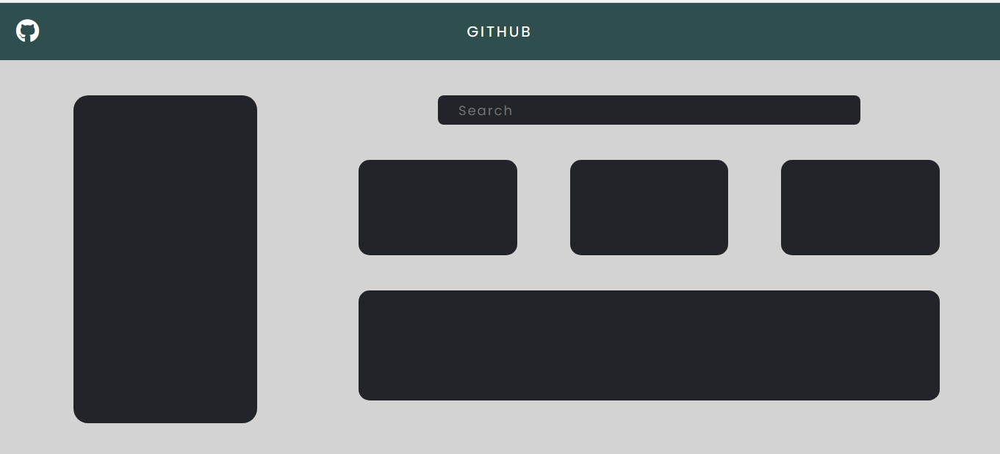

# GitHub Profile Page

It's sample GitHub profile page which was designed by me. It's my Guvi-Zen class Day-12(HTML & CSS- Day -5) Task.

## Tech Stack

- HTML
- CSS
- Bootstrap

## Lessons Learned

I learned to write media Queries in css and some specified classes in Bootstrap during this project

## Features

- Responsive Design

## Website

[My GitHub Profile Page](https://git-hub-profile-page.vercel.app/)

## Screenshots

## Feedback

If you have any feedback, please reach out to me at vijaymayhul@gmail.com

